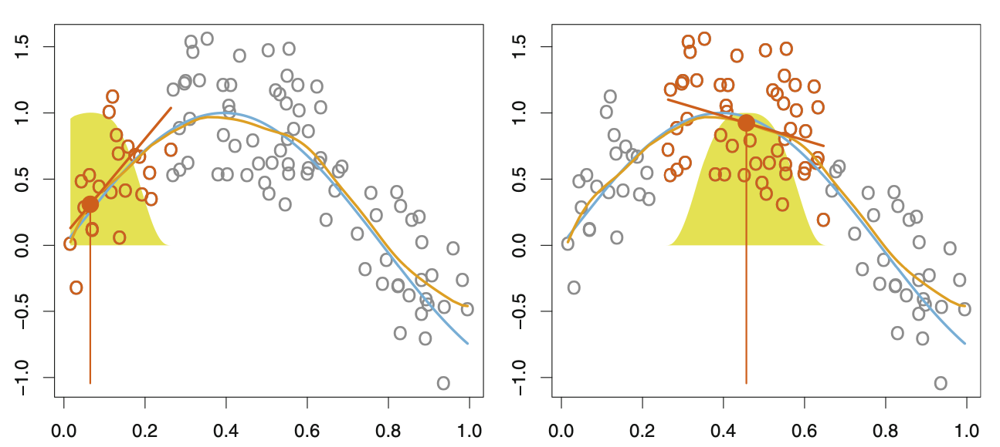

```{r setup, include=FALSE}
knitr::opts_chunk$set(echo = FALSE)
```

# Definición
##
<div style="text-align: justify">

La regresión local (LOESS o LOWESS) es otra aproximación para obtener modelos no lineales. Se caracteriza por ajustar modelos simples a distintas subregiones del rango del predictor empleando únicamente las observaciones cercanas, evitando así recurrir a una única función global compleja. El concepto puede recordar al descrito en regression splines y smoothing splines, de hecho, es muy similar, la diferencia es que en la regresión local las regiones son solapantes, cosa que no ocurre en los otros dos métodos.

<div/>

<center>
{width=800px}

# Parámetros
##
<div style="text-align: justify">

### SPAN


### GRADO DEL POLINOMIO


### FUNCIÓN PARA DESIGNAR PESOS


<div/>

# Algoritmo
##
<div style="text-align: justify">

Para cada posición x0 ocupada por una observación:

1. Se identifican la fracción $s=\frac{k}{n}$ de observaciones más cercanas al punto $x_{0}$.

2. Se asigna un peso a cada observación vecina (dentro de las seleccionadas en el paso 1) de forma que la observación más alejada tiene peso 0 y la más cercana tiene el mayor peso. Todas las demás observaciones del set de datos tienen peso 0.

3. Ajuste weighted least squares regression.

4. El valor predicho de x0 viene dado por el ajuste obtenido en el paso 3.


<div/>

# Ventajas y desventajas
##
<div style="text-align: justify">

### **VENTAJAS**

* Combina la simplicidad de la regresión lineal por mínimos cuadrados con la flexibilidad de la regresión no lineal.

* No necesita que especifiquemos una función para ajustar el modelo.

* Es muy flexible, lo que es ideal para el modelado de procesos complejos para los que no existen modelos teóricos.

* Es sencilla.

### **DESVENTAJAS**

* Necesita una muestra numerosa para obtener buenos modelos.

* No producen una función de regresión fácilmente representable por una fórmula matemática.

* Es sensible a los efectos de valores atípicos en los datos (al igual que en otros métodos basados en distancias cuadráticas).

<div/>

# Ejemplo en R
##
<div style="text-align: justify">

```{r echo=FALSE}
library(ISLR)
set.seed(1)
# Índice observaciones de entrenamiento
train <- sample(nrow(Auto), 0.8*nrow(Auto), replace = FALSE)
datosA.train <- Auto[train, ]
datosA.test <- Auto[-train, ]

# REGRESIÓN LOCAL
modelo.local <- loess(mpg ~ displacement, span = 0.7, data = datosA.train)

library(ggplot2)
ggplot(data = datosA.train, aes(x = displacement, y = mpg)) +
geom_point(col = "darkgrey") +
geom_smooth(method = "loess", formula = y ~ x, span = 0.2, 
            color = "orange", se = F) +
geom_smooth(method = "loess", formula = y ~ x, span = 0.7, 
            color = "brown", se = F) +
labs(title = "Regresión local: mpg ~ displacement") +
theme_bw() + theme(plot.title = element_text(hjust = 0.5)) +
geom_text(aes(label = "span = 0.2", x = 400, y = 40), size = 5, 
          colour = "orange") +
geom_text(aes(label = "span = 0.7", x = 400, y = 35), size = 5, 
          colour = "brown")
```

<div/>


## Bibliografía

bibliografia.bib
